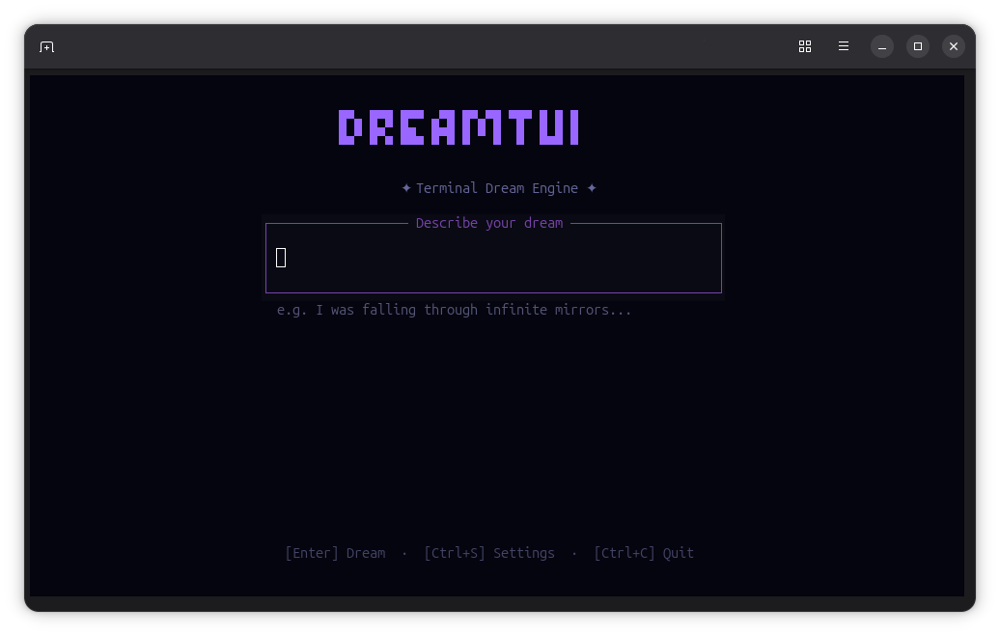
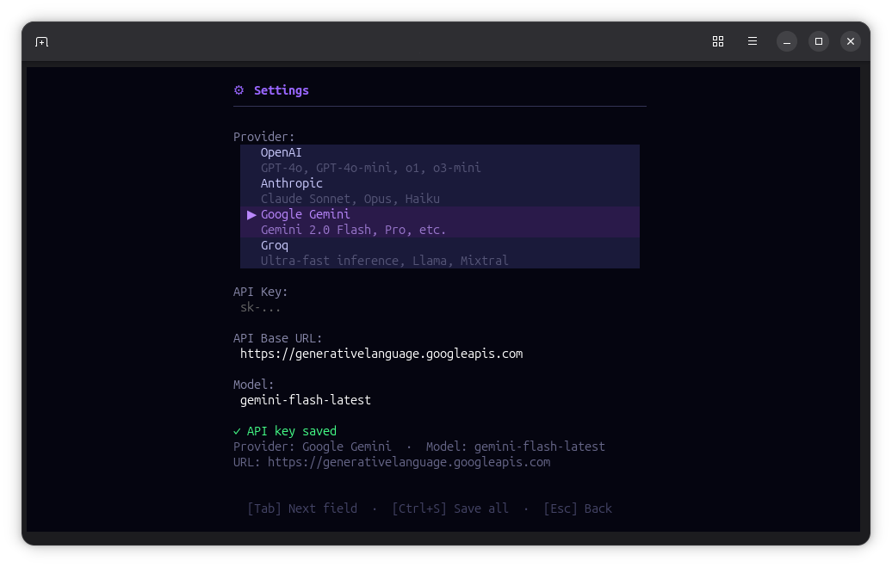

# DreamTUI

**A terminal-based generative dream engine.**

DreamTUI transforms your written dreams into full-screen, animated ASCII art experiences. It uses a sophisticated two-stage AI pipeline to interpret the semantics of your dream and generate a procedural visualization that plays out directly in your terminal.



> [!IMPORTANT]
> This is an experimental hobby project created to test the concept of AI-driven ASCII visualization. It is currently in a prototype stage (and frankly, it will probably stay that way forever). However, the project is open source and **contributions are highly welcome**!


## Features

- **AI-Powered Interpretation**:
  - **Dream Booster**: Enhances simple inputs into vivid, descriptive narratives.
  - **Semantic Analysis**: Extracts mood, symbols, tempo, and atmosphere from your text.

- **ASCII Rendering Engine**:
  - **Layered Composition**: Combines background noise, symbols, and distortion effects.
  - **Procedural Animation**: Real-time animation loop reacting to dream parameters.
  - **Dynamic Distortions**: Visual wobbles and shifts representing dream instability.

- **Modern TUI (Terminal User Interface)**:
  - **Interactive Screens**: Dedicated screens for Input, Animation, and Settings.
  - **Responsive Design**: Adapts gracefully to terminal resizing.
  - **Keyboard Controls**: Full keyboard navigation support.

- **Flexible AI Providers**:
  - Supports multiple LLM providers:
    - OpenAI
    - Anthropic
    - Google Gemini
    - Groq
    - Ollama (Local)
  - Configurable via the built-in Settings UI.

## Getting Started

### Prerequisites

- [Bun](https://bun.sh/) (v1.0 or later recommended)
- A terminal with TrueColor support.

### Installation

1. **Clone the repository:**

   ```bash
   git clone https://github.com/sametcn99/dreamtui.git
   cd dreamtui
   ```

2. **Install dependencies:**

   ```bash
   bun install
   ```

3. **Run the application:**

   ```bash
   bun start
   ```

## Usage

### 1. The Input Screen

When the app launches, you will see the **Input Screen**.

- **Type your dream**: Enter a description of a dream (e.g., "I was flying over a neon city made of glass").
- **Submit**: Press `Enter` to start the dream generation process.
- **Settings**: Press `Ctrl+S` to open the configuration menu.

### 2. The Dream Experience

Once generated, the visualization will start automatically.

- **Movement**: The ASCII art flows according to the dream's tempo (calm, chaotic, fast, slow).
- **Controls**:
  - `Space`: Pause/Result animation.
  - `R`: Restart the dream loop.
  - `Esc`: Exit back to the Input Screen.

### 3. Settings Configuration

Access settings by pressing `Ctrl+S` on the Input Screen.



- **Provider**: Select your preferred AI backend (e.g., OpenAI, Anthropic).
- **API Key**: Enter your API key securely (stored locally).
- **Model**: (Optional) Override the default model (e.g., `gpt-4o-mini`, `claude-3-opus`).
- **Navigation**: Use `Tab` to cycle fields, `Ctrl+S` to Save, `Esc` to go back.

## Contributing

Contributions are welcome! Whether it's adding new visual layers, supporting more AI providers, or improving the TUI.

1. Fork the project.
2. Create your feature branch (`git checkout -b feature/AmazingFeature`).
3. Commit your changes (`git commit -m 'Add some AmazingFeature'`).
4. Push to the branch (`git push origin feature/AmazingFeature`).
5. Open a Pull Request.
